  

  
  
  

## About

I build products end to end: from the database schema and API to the admin dashboard, the mobile app and deployment. Most of my work comes from real businesses — a logistics company that needs live fleet tracking, a music school that needs to run its whole operation from one desktop app.

## Selected work

| Project | Line | What it is | Stack |
|---|---|---|---|
| [**LogiTrack System**](https://github.com/kyetim/LogiTrack-System) |  | Real-time fleet management: admin dashboard, driver mobile app and backend with live location tracking | NestJS, PostgreSQL + PostGIS, Redis, Socket.io, Next.js, React Native (Expo), Docker |
| [**Ufuk Lojistik**](https://github.com/kyetim/ufuk-logistic-clean) |  | Bilingual (TR/EN) corporate site for a logistics company with an interactive 3D catalog | React, Vite, TypeScript, Tailwind, three.js |
| [**Lirik Sanat Evi — desktop**](https://github.com/kyetim/liriksanatevi-otomasyon) |  | Management system for a music school: students, teachers, scheduling, payments, reports, role-based access, SMS, backups | Electron, React, TypeScript, SQLite, Zod |
| [**Lirik Sanat Evi — web**](https://github.com/kyetim/lirik-sanat-evi) |  | Website and lead generation for the same music academy | Next.js, TypeScript, Tailwind, Supabase, Vercel |
| [**Mızmız Social**](https://github.com/kyetim/mizmiz-social-app) |  | Social platform with feed, real-time messaging and notifications | Next.js, Express, PostgreSQL, Prisma, Socket.IO |

## Tech I work with

| Area | Tools |
|---|---|
| **Frontend** |     |
| **Backend** |      |
| **Data** |       |
| **Mobile & desktop** |    |
| **Tooling** |     |

---

<b>🇹🇷 Türkçe</b>

 

Ürünleri uçtan uca geliştiriyorum: veritabanı şeması ve API'den yönetim paneline, mobil uygulamaya ve canlıya almaya kadar. İşlerimin çoğu gerçek işletmelerden geliyor — canlı araç takibine ihtiyaç duyan bir lojistik firması, tüm operasyonunu tek bir masaüstü uygulamadan yönetmek isteyen bir müzik okulu gibi.

Öne çıkan projelerim yukarıdaki tabloda. Remote çalışmaya açığım; iletişim için LinkedIn veya e-posta.

